<p align="center">
  
</p>
---

### 📈 Live Competitive Programming Stats

<p align="center">
  <a href="https://leetcode.com/u/code-by-rohit1/" target="_blank">
    
  </a>
  &nbsp;
  <a href="https://www.codechef.com/users/caffeine_rohit" target="_blank">
    
  </a>
</p>

<p align="center">
  <a href="https://github.com/ROhitg-upta" target="_blank">
    
  </a>
  &nbsp;
  <a href="https://www.hackerrank.com/profile/rohitguptaitc1" target="_blank">
    
  </a>
</p>

---

### 👨‍💻 About Me

* 🎓 **Education**: Pursuing B.Tech in Computer Science & Engineering at **ABES Engineering College**.
* 🚀 **Focus Areas**: Full Stack Development, Artificial Intelligence, Data Structures & Algorithms, Problem Solving, and Hackathons.
* 💡 **Core Strengths**: Problem Solving, DSA, Web Development, Project Building, Team Collaboration, and Learning New Technologies.
* 🎯 **Current Goals**: Strengthening DSA, building production-ready full-stack applications, exploring AI, contributing to open source, and participating in impactful hackathons.
* 💬 **Ask me about**: C++, DSA, React, JavaScript, Node.js, Express.js, Web Development, and Hackathon Projects.
* ⚡ **Currently Building**: **Nyaya Revolution — AI-Powered Legal Learning Platform for India**.

---

### 🛠️ Tech Stack & Skills

#### 💻 Programming Languages & Core

<p align="left">
  
  
  
  
  
  
</p>

#### 🌐 Full Stack Development

<p align="left">
  
  
  
  
  
  
</p>

#### 🗄️ Database & Backend Technologies

<p align="left">
  
  
  
</p>

#### 🤖 AI & Emerging Technologies

<p align="left">
  
  
  
</p>

#### ⚙️ Developer Tools

<p align="left">
  
  
  
  
  
</p>

---

### 🚀 Featured Projects

> A glimpse of what I've been building — explore more on my **[GitHub →](https://github.com/ROhitg-upta?tab=repositories)**

<table width="100%">
  <tr>
    <td width="50%" valign="top">
      <h4>⚖️ <a href="https://github.com/ROhitg-upta">Nyaya Revolution</a></h4>
      <p>An AI-powered legal learning platform designed to make legal awareness accessible through simple explanations, real-world scenarios, AI tutoring, quizzes, and personalized learning.</p>
      <a href="https://github.com/ROhitg-upta">
        
      </a>
    </td>

```
<td width="50%" valign="top">
  <h4>🌐 <a href="https://github.com/ROhitg-upta">Full Stack Projects</a></h4>
  <p>Building modern web applications using React, JavaScript, Node.js, Express.js, Tailwind CSS, and database technologies.</p>
  <a href="https://github.com/ROhitg-upta?tab=repositories">
    
  </a>
</td>
```

  </tr>

  <tr>
    <td width="50%" valign="top">
      <h4>🏆 <a href="https://github.com/ROhitg-upta">Hackathon Projects</a></h4>
      <p>Participating in hackathons and building technology-driven solutions focused on solving real-world problems.</p>
      <a href="https://github.com/ROhitg-upta?tab=repositories">
        
      </a>
    </td>

```
<td width="50%" valign="top">
  <h4>💻 <a href="https://leetcode.com/u/code-by-rohit1/">DSA & Problem Solving</a></h4>
  <p>Consistently practicing Data Structures & Algorithms and competitive programming to improve algorithmic thinking and problem-solving skills.</p>
  <a href="https://leetcode.com/u/code-by-rohit1/">
    
  </a>
</td>
```

  </tr>
</table>

---

### 🎯 Current Focus

<p align="center">


</p>

---

### 📊 GitHub Metrics

<p align="center">
  
</p>

<p align="center">
  
</p>

<p align="center">
  
</p>

<p align="center">
  
</p>

---

### 🧩 Developer Journey

<p align="center">

```text
                    🏆 DREAM BIG
                         ▲
                         │
                  🚀 BUILD PRODUCTS
                         ▲
                         │
                  🤖 EXPLORE AI
                         ▲
                         │
                  🏆 HACKATHONS
                         ▲
                         │
                  🌐 FULL STACK
                         ▲
                         │
                    🧠 DSA
                         ▲
                         │
                     💻 C++
                         ▲
                         │
                   👨‍💻 CODE
```

</p>

---

### 📬 Connect & Collaborate

<p align="center">

  <a href="https://github.com/ROhitg-upta">
    
  </a>
  &nbsp;&nbsp;

  <a href="https://leetcode.com/u/code-by-rohit1/">
    
  </a>
  &nbsp;&nbsp;

  <a href="https://www.codechef.com/users/caffeine_rohit">
    
  </a>
  &nbsp;&nbsp;

  <a href="https://www.hackerrank.com/profile/rohitguptaitc1">
    
  </a>

</p>

<p align="center">
  
  &nbsp;
  
</p>

---

<p align="center">
  <sub>Designed &amp; Crafted with ❤️ by <a href="https://github.com/ROhitg-upta">Rohit Kumar Gupta</a></sub>
</p>
